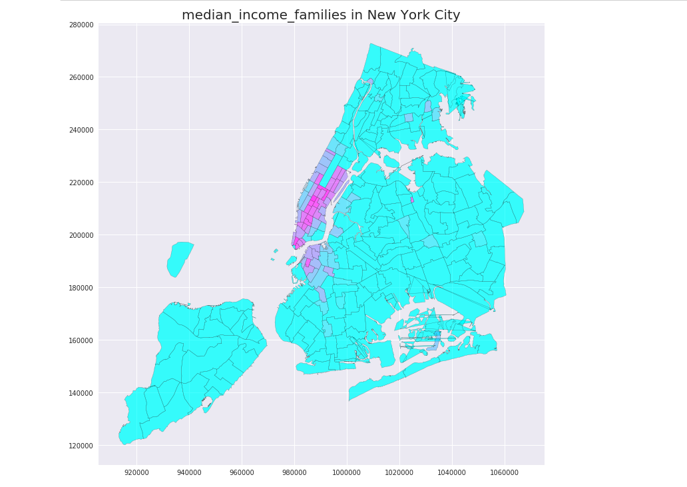

### Figure one: This figure representes the spatial data for the location of median income New York household. Acoording to the map, most of the median income families locates in manhattan, especially in lower east side and midtown, as well as downtown Brooklyn. 